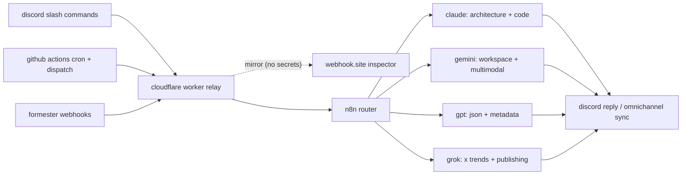

<svg xmlns="http://www.w3.org/2000/svg" viewBox="0 0 1200 340" width="1200" height="340" role="img" aria-label="tgt international multi-model ai agency">
  <defs>
    <linearGradient id="bg" x1="0" y1="0" x2="1" y2="1">
      <stop offset="0" stop-color="#05050a"/>
      <stop offset="1" stop-color="#14060b"/>
    </linearGradient>
    <radialGradient id="aura" cx="0.5" cy="0.5" r="0.5">
      <stop offset="0" stop-color="#ff1e3c" stop-opacity="0.35"/>
      <stop offset="1" stop-color="#ff1e3c" stop-opacity="0"/>
    </radialGradient>
    <linearGradient id="hair" x1="0" y1="0" x2="0" y2="1">
      <stop offset="0" stop-color="#ffe9a3"/>
      <stop offset="1" stop-color="#d9a93a"/>
    </linearGradient>
    <filter id="glow" x="-60%" y="-60%" width="220%" height="220%">
      <feGaussianBlur stdDeviation="4" result="b"/>
      <feMerge><feMergeNode in="b"/><feMergeNode in="SourceGraphic"/></feMerge>
    </filter>
    <pattern id="grid" width="40" height="40" patternUnits="userSpaceOnUse">
      <path d="M40 0H0V40" fill="none" stroke="#fff" stroke-opacity="0.04"/>
    </pattern>
    <g id="bar">
      <rect x="0" y="30" width="6" height="118" fill="#ff1e3c" fill-opacity="0.6">
        <animateTransform attributeName="transform" type="translate" values="0 0;0 -22;0 0" dur="4s" repeatCount="indefinite"/>
      </rect>
      <rect x="0" y="192" width="6" height="118" fill="#ff1e3c" fill-opacity="0.6">
        <animateTransform attributeName="transform" type="translate" values="0 0;0 22;0 0" dur="4s" repeatCount="indefinite"/>
      </rect>
      <rect x="-3" y="168" width="12" height="3" fill="#ffffff">
        <animate attributeName="opacity" values="0;1;0" dur="4s" repeatCount="indefinite"/>
      </rect>
    </g>
  </defs>

  <rect width="1200" height="340" fill="url(#bg)"/>
  <rect width="1200" height="340" fill="url(#grid)"/>
  <circle cx="260" cy="170" r="160" fill="url(#aura)"/>

  <!-- breaking containment bars -->
  <use href="#bar" x="70"/>
  <use href="#bar" x="100"/>
  <use href="#bar" x="420"/>
  <use href="#bar" x="450"/>

  <!-- rotating orbital rings (fake 3d tilt via animated ry) -->
  <g transform="translate(260 170)" fill="none" stroke-linecap="round">
    <g>
      <animateTransform attributeName="transform" type="rotate" from="0" to="360" dur="14s" repeatCount="indefinite"/>
      <ellipse rx="150" ry="40" stroke="#ff1e3c" stroke-width="2" stroke-dasharray="18 10" filter="url(#glow)">
        <animate attributeName="ry" values="40;140;40" dur="7s" repeatCount="indefinite"/>
        <animate attributeName="stroke-dashoffset" from="0" to="-112" dur="3s" repeatCount="indefinite"/>
      </ellipse>
    </g>
    <g>
      <animateTransform attributeName="transform" type="rotate" from="360" to="0" dur="18s" repeatCount="indefinite"/>
      <ellipse rx="125" ry="110" stroke="#ffffff" stroke-opacity="0.45" stroke-width="1.5" stroke-dasharray="4 8">
        <animate attributeName="ry" values="110;30;110" dur="9s" repeatCount="indefinite"/>
      </ellipse>
    </g>
    <g transform="rotate(60)">
      <animateTransform attributeName="transform" type="rotate" from="60" to="420" dur="22s" repeatCount="indefinite"/>
      <ellipse rx="100" ry="30" stroke="#ff1e3c" stroke-opacity="0.6" stroke-width="1.5">
        <animate attributeName="ry" values="30;100;30" dur="5s" repeatCount="indefinite"/>
      </ellipse>
    </g>
  </g>

  <!-- cyber-architect silhouette -->
  <g>
    <path d="M140 340 C140 262 188 232 226 222 L294 222 C332 232 380 262 380 340 Z" fill="#0b0b12" stroke="#ff1e3c" stroke-opacity="0.45"/>
    <rect x="243" y="190" width="34" height="38" fill="#0b0b12"/>
    <ellipse cx="260" cy="150" rx="41" ry="52" fill="#0b0b12" stroke="#ff1e3c" stroke-opacity="0.35"/>
    <path d="M213 146 C206 96 242 78 270 82 C304 86 316 114 307 146 C298 122 282 110 262 110 C240 110 224 122 213 146 Z" fill="url(#hair)"/>
    <path d="M213 146 C204 170 208 196 222 212 C218 188 220 166 228 150 Z" fill="url(#hair)"/>
    <path d="M307 146 C316 170 312 196 298 212 C302 188 300 166 292 150 Z" fill="url(#hair)"/>
    <rect x="222" y="140" width="76" height="17" rx="8.5" fill="#ff1e3c" filter="url(#glow)">
      <animate attributeName="opacity" values="0.7;1;0.7" dur="2.4s" repeatCount="indefinite"/>
    </rect>
    <rect x="228" y="144" width="10" height="9" rx="4.5" fill="#ffffff" fill-opacity="0.8">
      <animate attributeName="x" values="228;282;228" dur="3s" repeatCount="indefinite"/>
    </rect>
  </g>

  <!-- scanline -->
  <rect x="0" y="0" width="1200" height="2" fill="#ff1e3c" fill-opacity="0.15">
    <animate attributeName="y" values="0;340" dur="5s" repeatCount="indefinite"/>
  </rect>

  <!-- text -->
  <g font-family="'SF Mono','Fira Code',Consolas,'Courier New',monospace">
    <text x="560" y="96" font-size="14" fill="#ff1e3c" letter-spacing="3">cl40world_security_locked  ·  tgt_active_2027</text>
    <text x="560" y="160" font-size="52" font-weight="700" fill="#ffffff">tgt international</text>
    <text x="560" y="206" font-size="32" fill="#cfcfd8">multi-model ai agency</text>
    <text x="560" y="250" font-size="18" fill="#8a8a96">111 autonomous bots  ·  +240 billion global reach</text>
    <text x="560" y="282" font-size="14" fill="#5d5d68">chico loco 40  ·  cl40 world llc  ×  wr beats music group</text>
    <rect x="560" y="296" width="14" height="3" fill="#ff1e3c">
      <animate attributeName="opacity" values="1;0;1" dur="1s" repeatCount="indefinite"/>
    </rect>
  </g>
</svg>
<div align="center">


**111 autonomous bots · 4 llms · 1 relay**

[](mailto:founder.american@cl40.world)
[](mailto:legal@cl40.world)

</div>

---

## identity

| field | value |
|---|---|
| owner / founder / systems architect | samir libari — **chico loco 40** |
| parent syndicate | cl40 world llc · wr beats music group |
| structure | 20 international corporate & label divisions · us ein & australian abn registered |
| system | tgt international multi-model ai agency · 111 autonomous bots |
| tags | `CL40WORLD_SECURITY_LOCKED` · `TGT_ACTIVE_2027` · `+240 Billion Global Reach` |

## catalog reference

| field | value |
|---|---|
| recording | *dark libari 2010* |
| artist | chico loco 40 |
| musicbrainz id | `22fLaOOBnTXVHiM7fe16jZ` |
| isrc | `TLY5Z3732842` |
| release date | `2026-11-18` |
| stream | [audiomack](https://audiomack.com/chicoloco40/song/dark-libari-2010) |

---

## ecosystem

### portals & community

[](https://cl40.world)
[](https://cl40.contact)
[](https://cl40.world)
[](https://links.fans/chicoloco40)
[](https://cl40-world-1273.taskade.app/)
[](https://discord.com/oauth2/authorize?client_id=1510455630387740812&response_type=code&redirect_uri=https://cl40.contact/&scope=identify)
[](https://discord.gg)
[](https://cl40worldportal.quora.com/)

### music & catalog

[](https://audiomack.com/chicoloco40/song/dark-libari-2010)
[](https://soundcloud.com/chico-loco-40)
[](https://www.beatstars.com/chicoloco40)
[](https://genius.com/artists/Chico-loco-40)
[](https://songshare.com/artist/a2g7yslh)
[](https://archive.org/details/136b-top-trends-by-cl-40-world)

### publishing & journalism

[](https://substack.com/@cl40world)
[](https://chicoloco40.wordpress.com/)
[](https://medium.com/@cl40world)
[](https://booklabria.com)
[](https://writeupcafe.com/author/chicoloco40)
[](https://mumubl.com/members/chicoloco40/profile/)

### developer, academic & executive

[](https://roadmap.sh/u/cl40world)
[](https://scholar.google.com/citations?user=lofDR3kAAAAJ&hl=en&scioq=Samir+Libari)
[](https://orcid.org/0009-0001-4557-4898)
[](https://about.me/samir-libari)
[](https://wellfound.com/u/samir-libari)
[](https://www.ted.com/profiles/52159764)

### visual arts, cinema & store

[](https://letterboxd.com/samirlibari/)
[](https://www.senscritique.com/cl40world)
[](https://www.behance.net/cl40world)
[](https://www.deviantart.com/cl40world)
[](https://benable.com/chicoloco_40)
[](https://www.redbubble.com/people/cl40world/shop)

### legal policies & webhook forms

[](https://www.termsfeed.com/live/17b107e2-d672-47a0-b941-e500a59dff48)
[](https://www.termsfeed.com/live/24a824fb-3c4c-4d21-94f1-620d724ad834)
[](https://zpifiscs.formester.com/f/BHTHcDKg6)
[](https://zpifiscs.formester.com/f/vjUo40oqQ)

---

## architecture


```mermaid
flowchart LR
  d["discord slash commands"] --> w["cloudflare worker relay"]
  gh["github actions cron + dispatch"] --> w
  fm["formester webhooks"] --> w
  w -. "mirror (no secrets)" .-> wh["webhook.site inspector"]
  w --> n["n8n router"]
  n --> c["claude: architecture + code"]
  n --> g["gemini: workspace + multimodal"]
  n --> o["gpt: json + metadata"]
  n --> x["grok: x trends + publishing"]
  c --> r["discord reply / omnichannel sync"]
  g --> r
  o --> r
  x --> r
```

## relay stack


| layer | role | cost profile |
|---|---|---|
| discord (`client_id=1510455630387740812`) | slash-command entry, replies | free |
| webhook.site | instant payload inspection / routing mirror | free tier |
| cloudflare workers | edge relay, signature check, llm routing key | free / low |
| n8n | llm calls, formatting, fan-out | low |
| github actions | cron ticks, `repository_dispatch` triggers | free / low |

## multi-llm routing


| llm | role | slash command | `llm` key |
|---|---|---|---|
| claude | architecture / code | `/architect` | `claude` |
| gemini | google workspace / multimodal | `/workspace` | `gemini` |
| gpt | json / metadata | `/metadata` | `gpt` |
| grok | live x trends / automated publishing | `/trends` | `grok` |

## bot fleet — 111 autonomous bots

| squad | bots | relay targets |
|---|---|---|
| relay & ops | 11 | [official portal](https://cl40.world) · [contact gateway](https://cl40.contact) · [press hub](https://cl40.world) · health + alert bots |
| publishing | 22 | [substack](https://substack.com/@cl40world) · [wordpress](https://chicoloco40.wordpress.com/) · [medium](https://medium.com/@cl40world) · [booklabria](https://booklabria.com) · [writeupcafe](https://writeupcafe.com/author/chicoloco40) · [mumubl](https://mumubl.com/members/chicoloco40/profile/) · [quora](https://cl40worldportal.quora.com/) · [internet archive](https://archive.org/details/136b-top-trends-by-cl-40-world) |
| catalog & rights | 22 | [audiomack](https://audiomack.com/chicoloco40/song/dark-libari-2010) · [soundcloud](https://soundcloud.com/chico-loco-40) · [beatstars](https://www.beatstars.com/chicoloco40) · [genius](https://genius.com/artists/Chico-loco-40) · [songshare](https://songshare.com/artist/a2g7yslh) · [links.fans](https://links.fans/chicoloco40) · spotify · apple music |
| social & trends | 22 | x (grok) · [letterboxd](https://letterboxd.com/samirlibari/) · [senscritique](https://www.senscritique.com/cl40world) · [behance](https://www.behance.net/cl40world) · [deviantart](https://www.deviantart.com/cl40world) · [benable](https://benable.com/chicoloco_40) · [redbubble](https://www.redbubble.com/people/cl40world/shop) |
| community | 22 | [discord server](https://discord.gg) · [discord oauth](https://discord.com/oauth2/authorize?client_id=1510455630387740812&response_type=code&redirect_uri=https://cl40.contact/&scope=identify) · [taskade](https://cl40-world-1273.taskade.app/) · [formester 1](https://zpifiscs.formester.com/f/BHTHcDKg6) · [formester 2](https://zpifiscs.formester.com/f/vjUo40oqQ) |
| identity & academic | 12 | [roadmap.sh](https://roadmap.sh/u/cl40world) · [google scholar](https://scholar.google.com/citations?user=lofDR3kAAAAJ&hl=en&scioq=Samir+Libari) · [orcid](https://orcid.org/0009-0001-4557-4898) · [about.me](https://about.me/samir-libari) · [wellfound](https://wellfound.com/u/samir-libari) · [ted](https://www.ted.com/profiles/52159764) |

## omnichannel sync

| target | route |
|---|---|
| x (twitter) | grok → x api post |
| discord | interaction follow-up / channel webhook |
| spotify · apple music | catalog + metadata link sync |
| substack · wordpress | draft / publish via api |
| audiomack · soundcloud · beatstars · genius | link + metadata sync |
| taskade · formester | webhook in / out |

---

## code

<details>
<summary>relay/worker.js — cloudflare worker (discord + webhook relay)</summary>

```js
const TASKS = { architect: "claude", workspace: "gemini", metadata: "gpt", trends: "grok" };

const json = (o, s = 200) =>
  new Response(JSON.stringify(o), { status: s, headers: { "content-type": "application/json" } });

const hex = (h) => Uint8Array.from(h.match(/.{2}/g).map((b) => parseInt(b, 16)));

async function verifyDiscord(body, sig, ts, publicKey) {
  const key = await crypto.subtle.importKey("raw", hex(publicKey), { name: "Ed25519" }, false, ["verify"]);
  return crypto.subtle.verify("Ed25519", key, hex(sig), new TextEncoder().encode(ts + body));
}

async function forward(env, msg) {
  const body = JSON.stringify({ ...msg, ts: Date.now() });
  const jobs = [
    fetch(env.N8N_WEBHOOK_URL, {
      method: "POST",
      body,
      headers: { "content-type": "application/json", "x-cl40-secret": env.RELAY_SECRET },
    }),
  ];
  // inspection mirror: no secret header, discord token stripped
  if (env.WEBHOOK_SITE_URL) {
    jobs.push(
      fetch(env.WEBHOOK_SITE_URL, {
        method: "POST",
        body: JSON.stringify({ ...msg, token: undefined }),
        headers: { "content-type": "application/json" },
      })
    );
  }
  await Promise.allSettled(jobs);
}

export default {
  async fetch(req, env, ctx) {
    if (req.method !== "POST") return new Response("cl40 relay online");
    const raw = await req.text();
    const sig = req.headers.get("x-signature-ed25519");
    const ts = req.headers.get("x-signature-timestamp");

    // discord interaction
    if (sig && ts) {
      if (!(await verifyDiscord(raw, sig, ts, env.DISCORD_PUBLIC_KEY)))
        return new Response("bad signature", { status: 401 });
      const i = JSON.parse(raw);
      if (i.type === 1) return json({ type: 1 }); // ping
      const cmd = i.data?.name ?? "architect";
      ctx.waitUntil(
        forward(env, {
          source: "discord",
          command: cmd,
          llm: TASKS[cmd] ?? "claude",
          options: i.data?.options ?? [],
          user: i.member?.user?.id ?? i.user?.id,
          token: i.token,
          application_id: i.application_id,
        })
      );
      return json({ type: 5 }); // deferred: n8n edits the reply
    }

    // generic webhook (github actions, formester, manual)
    if (req.headers.get("x-cl40-secret") !== env.RELAY_SECRET)
      return new Response("forbidden", { status: 403 });
    ctx.waitUntil(forward(env, { source: "webhook", ...JSON.parse(raw) }));
    return json({ ok: true });
  },
};
```

</details>

<details>
<summary>n8n/cl40-relay.workflow.json — import into n8n</summary>

```json
{
  "name": "cl40 relay",
  "nodes": [
    {
      "parameters": { "httpMethod": "POST", "path": "cl40-relay", "authentication": "headerAuth", "options": {} },
      "id": "a1",
      "name": "relay in",
      "type": "n8n-nodes-base.webhook",
      "typeVersion": 2,
      "position": [0, 0],
      "webhookId": "cl40-relay"
    },
    {
      "parameters": {
        "jsCode": "const b = $input.first().json.body;\nconst M = { claude: 'claude-sonnet-5-5', gemini: 'gemini-2.5-flash', gpt: 'gpt-4.1-mini', grok: 'grok-4' };\nconst p = (b.options || []).map(o => o.value).join(' ') || b.prompt || 'status report';\nconst llm = M[b.llm] ? b.llm : 'claude';\nconst msg = [{ role: 'user', content: p }];\nconst C = {\n  claude: { url: 'https://api.anthropic.com/v1/messages', headers: { 'x-api-key': $vars.ANTHROPIC_API_KEY, 'anthropic-version': '2023-06-01' }, body: { model: M.claude, max_tokens: 1024, messages: msg } },\n  gemini: { url: 'https://generativelanguage.googleapis.com/v1beta/models/' + M.gemini + ':generateContent', headers: { 'x-goog-api-key': $vars.GEMINI_API_KEY }, body: { contents: [{ parts: [{ text: p }] }] } },\n  gpt: { url: 'https://api.openai.com/v1/chat/completions', headers: { Authorization: 'Bearer ' + $vars.OPENAI_API_KEY }, body: { model: M.gpt, messages: msg } },\n  grok: { url: 'https://api.x.ai/v1/chat/completions', headers: { Authorization: 'Bearer ' + $vars.XAI_API_KEY }, body: { model: M.grok, messages: msg } }\n};\nreturn [{ json: { ...C[llm], llm, token: b.token || null, application_id: b.application_id || null } }];"
      },
      "id": "a2",
      "name": "route",
      "type": "n8n-nodes-base.code",
      "typeVersion": 2,
      "position": [240, 0]
    },
    {
      "parameters": {
        "method": "POST",
        "url": "={{ $json.url }}",
        "sendHeaders": true,
        "specifyHeaders": "json",
        "jsonHeaders": "={{ JSON.stringify($json.headers) }}",
        "sendBody": true,
        "specifyBody": "json",
        "jsonBody": "={{ JSON.stringify($json.body) }}",
        "options": {}
      },
      "id": "a3",
      "name": "llm call",
      "type": "n8n-nodes-base.httpRequest",
      "typeVersion": 4.2,
      "position": [480, 0]
    },
    {
      "parameters": {
        "jsCode": "const r = $input.first().json;\nconst m = $('route').first().json;\nconst t = r.content?.[0]?.text ?? r.candidates?.[0]?.content?.parts?.[0]?.text ?? r.choices?.[0]?.message?.content ?? 'no output';\nconst url = m.token ? 'https://discord.com/api/v10/webhooks/' + m.application_id + '/' + m.token + '/messages/@original' : $vars.DISCORD_WEBHOOK_URL;\nreturn [{ json: { url, method: m.token ? 'PATCH' : 'POST', content: '[' + m.llm + '] ' + String(t).slice(0, 1900) } }];"
      },
      "id": "a4",
      "name": "format",
      "type": "n8n-nodes-base.code",
      "typeVersion": 2,
      "position": [720, 0]
    },
    {
      "parameters": {
        "method": "={{ $json.method }}",
        "url": "={{ $json.url }}",
        "sendBody": true,
        "specifyBody": "json",
        "jsonBody": "={{ JSON.stringify({ content: $json.content }) }}",
        "options": {}
      },
      "id": "a5",
      "name": "discord reply",
      "type": "n8n-nodes-base.httpRequest",
      "typeVersion": 4.2,
      "position": [960, 0]
    }
  ],
  "connections": {
    "relay in": { "main": [[{ "node": "route", "type": "main", "index": 0 }]] },
    "route": { "main": [[{ "node": "llm call", "type": "main", "index": 0 }]] },
    "llm call": { "main": [[{ "node": "format", "type": "main", "index": 0 }]] },
    "format": { "main": [[{ "node": "discord reply", "type": "main", "index": 0 }]] }
  },
  "settings": { "executionOrder": "v1" }
}
```

after import: open `relay in` → authentication → header auth → name `x-cl40-secret`, value = `RELAY_SECRET`. set model ids in the `route` node to your current ones.

</details>

<details>
<summary>.github/workflows/relay.yml — cron + dispatch trigger</summary>

```yaml
name: cl40 relay tick

on:
  schedule:
    - cron: "*/15 * * * *"
  workflow_dispatch:
    inputs:
      llm:
        description: "claude | gemini | gpt | grok"
        default: "grok"
      prompt:
        description: "task prompt"
        default: "top trends for chico loco 40"
  repository_dispatch:
    types: [cl40-relay]

jobs:
  relay:
    runs-on: ubuntu-latest
    timeout-minutes: 2
    steps:
      - name: post to cloudflare relay
        env:
          RELAY_URL: ${{ secrets.RELAY_URL }}
          RELAY_SECRET: ${{ secrets.RELAY_SECRET }}
          LLM: ${{ github.event.inputs.llm || github.event.client_payload.llm || 'grok' }}
          PROMPT: ${{ github.event.inputs.prompt || github.event.client_payload.prompt || 'top trends for chico loco 40' }}
        run: |
          jq -n --arg llm "$LLM" --arg prompt "$PROMPT" \
            '{source:"github_actions",llm:$llm,prompt:$prompt}' \
          | curl -fsS -X POST "$RELAY_URL" \
              -H "content-type: application/json" \
              -H "x-cl40-secret: $RELAY_SECRET" \
              --data-binary @-
```

</details>

<details>
<summary>discord slash-command registration body (one-time)</summary>

n8n → new workflow → http request node → method `PUT` → url `https://discord.com/api/v10/applications/1510455630387740812/commands` → header `Authorization: Bot <bot token>` → json body:

```json
[
  { "name": "architect", "description": "architecture + code (claude)", "type": 1, "options": [{ "name": "prompt", "description": "task", "type": 3, "required": true }] },
  { "name": "workspace", "description": "google workspace + multimodal (gemini)", "type": 1, "options": [{ "name": "prompt", "description": "task", "type": 3, "required": true }] },
  { "name": "metadata", "description": "json + metadata (gpt)", "type": 1, "options": [{ "name": "prompt", "description": "task", "type": 3, "required": true }] },
  { "name": "trends", "description": "live x trends + publishing (grok)", "type": 1, "options": [{ "name": "prompt", "description": "task", "type": 3, "required": true }] }
]
```

</details>

---

## secrets & variables

| where | name |
|---|---|
| cloudflare worker → settings → variables | `DISCORD_PUBLIC_KEY` · `RELAY_SECRET` · `N8N_WEBHOOK_URL` · `WEBHOOK_SITE_URL` (optional) |
| n8n → variables | `ANTHROPIC_API_KEY` · `GEMINI_API_KEY` · `OPENAI_API_KEY` · `XAI_API_KEY` · `DISCORD_WEBHOOK_URL` |
| github → settings → secrets and variables → actions | `RELAY_URL` · `RELAY_SECRET` |

no keys or tokens are committed to this repository.

## deploy (browser only)

1. cloudflare dashboard → workers & pages → create worker → paste `relay/worker.js` → add variables → deploy.
2. discord developer portal → application `1510455630387740812` → general information → interactions endpoint url = worker url. copy the public key into `DISCORD_PUBLIC_KEY`.
3. n8n → import `n8n/cl40-relay.workflow.json` → set variables + header-auth credential → activate → copy the production webhook url into `N8N_WEBHOOK_URL`.
4. n8n → run the slash-command registration once.
5. github → add `.github/workflows/relay.yml` → add `RELAY_URL` + `RELAY_SECRET` → actions → run workflow to test.
6. optional: paste a webhook.site url into `WEBHOOK_SITE_URL` to inspect every relayed payload.

---

<div align="center">

**cl40 world llc × wr beats music group**
`dignity above shares`

</div>
