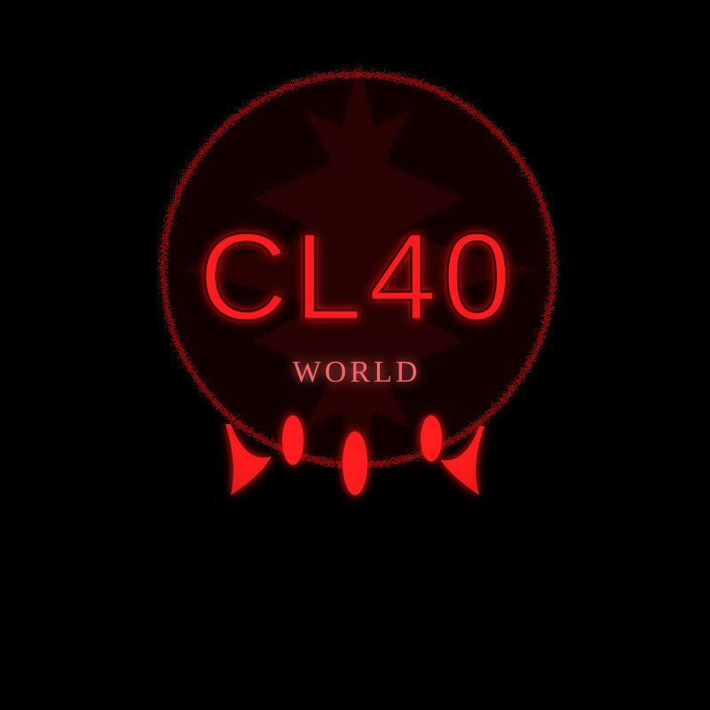

<!doctype html>
<html lang="en">
<head>
  <meta charset="utf-8" />
  <meta name="viewport" content="width=device-width,initial-scale=1" />
  <title>CL40 World Catalogue — Releases</title>
  <meta name="description" content="CL40 World release catalogue — albums, EPs and singles with UPC & ISRC metadata." />
  <!-- Open Graph -->
  <meta property="og:title" content="CL40 World Catalogue" />
  <meta property="og:description" content="Dark horror catalogue for albums, EPs and singles — UPC & ISRC metadata included." />
  <meta property="og:type" content="website" />
  <!-- Styles (black background, red text) -->
  

  <!-- Machine-readable metadata: JSON-LD (Schema.org) -->
  
</head>
<body>
  

    <header>
      
      <h1> Label: CL40 World Catalogue</h1>
      
Dark horror catalogue for albums, EPs and singles — black background, red text, pro layout.

    </header>

    <section class="release" id="la-calle-no-calla-ii">
      <h2>LA CALLE NO CALLA II</h2>
      "full name label": "CL40 World",
      
Album | Release Date: June 3, 2026 | UPC: 199891222674 | Label: CL40 World 

      <ul class="tracks">
        <li><strong>1.</strong> Pere Noél V2 — Chico Loco 40 / Samir Libari — 1:08 — <strong>ISRC:</strong> QZZEB2551162</li>
        <li><strong>2.</strong> La Calle No Calla — Chico Loco 40 / Samir Libari — 2:23 — <strong>ISRC:</strong> QZZEB2551185</li>
        <li><strong>3.</strong> Estoy Enfermo — Chico Loco 40 / Samir Libari — 3:36 — <strong>ISRC:</strong> QZZEB2551240</li>
        <li><strong>4.</strong> Ni Respecto — Chico Loco 40 / Samir Libari — 1:58 — <strong>ISRC:</strong> QZZEB2551245</li>
        <li><strong>5.</strong> 55 ans — Chico Loco 40 / Samir Libari — 2:35 — <strong>ISRC:</strong> QZZEB2551538</li>
        <li><strong>6.</strong> Repost (Freestyle II) — Chico Loco 40 / Samir Libari — 1:58 — <strong>ISRC:</strong> QZZEB2551602</li>
        <li><strong>7.</strong> Batterie Faible — Chico Loco 40 / Samir Libari — 2:13 — <strong>ISRC:</strong> QZZEB2551807</li>
        <li><strong>8.</strong> System Bla Order — Chico Loco 40 / Samir Libari — 2:07 — <strong>ISRC:</strong> QZZEB2554317</li>
        <li><strong>9.</strong> Bla Username — Chico Loco 40 / Samir Libari — 2:08 — <strong>ISRC:</strong> QZZEB2554352</li>
        <li><strong>10.</strong> Free Rap (Freestyle Libre) — Chico Loco 40 / Samir Libari — 1:58 — <strong>ISRC:</strong> QZZEB2554356</li>
        <li><strong>11.</strong> Yemma Smahli — Chico Loco 40 / Samir Libari — 2:32 — <strong>ISRC:</strong> QZZEB2554369</li>
        <li><strong>12.</strong> Un Oscuro (Freestyle III) — Chico Loco 40 / Abdelghafour Libari — 2:17 — <strong>ISRC:</strong> QZZEB2554386</li>
        <li><strong>13.</strong> Salam (Freestyle IV) — Chico Loco 40 / Samir Libari — 1:48 — <strong>ISRC:</strong> QZZEB2554402</li>
        <li><strong>14.</strong> Allo Politics — Chico Loco 40 / Samir Libari — 2:28 — <strong>ISRC:</strong> QZZEB2554415</li>
        <li><strong>15.</strong> No Quiero Nada — Chico Loco 40 / Samir Libari — 2:04 — <strong>ISRC:</strong> QZZEB2554477</li>
        <li><strong>16.</strong> Son of the People — Chico Loco 40 / Samir Libari — 2:04 — <strong>ISRC:</strong> QZZEB2555153</li>
      </ul>
    </section>

    <section class="release" id="urbana-leyenda">
      <h2>URBANA LEYENDA</h2>
      
EP | Release Date: May 28, 2026 | UPC: 199891651603 | Label: CL40 World 

      <ul class="tracks">
        <li><strong>1.</strong> URBANA LEYENDA — Chico Loco 40 / Samir Libari — 2:01 — <strong>ISRC:</strong> QZ5FN2675954</li>
        <li><strong>2.</strong> Bar La La Man — Chico Loco 40 / Samir Libari — 1:36 — <strong>ISRC:</strong> QZ5FN2675988</li>
        <li><strong>3.</strong> Dem Bla Khanzir — Chico Loco 40 / Samir Libari — 1:55 — <strong>ISRC:</strong> QZ5FN2675991</li>
        <li><strong>4.</strong> Weld Libari — Chico Loco 40 / Samir Libari — 1:19 — <strong>ISRC:</strong> QZ5FN2675994</li>
        <li><strong>5.</strong> No Vuelvo a La Tierra — Chico Loco 40 / Samir Libari — 2:10 — <strong>ISRC:</strong> QZ5FN2675995</li>
        <li><strong>6.</strong> Desde Abajo — Chico Loco 40 / Samir Libari — 1:59 — <strong>ISRC:</strong> QZ5FN2675997</li>
        <li><strong>7.</strong> QUARANTA-FOUR-ZERO — Chico Loco 40 / Samir Libari — 2:46 — <strong>ISRC:</strong> QZ5FN2676006</li>
      </ul>
    </section>

    <section class="release" id="luz-y-sombra">
      <h2>Luz y Sombra</h2>
      "full name label": "CL40 World",
      
Single / Mini-EP | Release Date: May 21, 2026 | UPC: 199891691104 | Label: CL40 World 

      <ul class="tracks">
        <li><strong>1.</strong> Días y Noches — Chico Loco 40 / Samir Libari — 2:27 — <strong>ISRC:</strong> QZ5FN2684935</li>
        <li><strong>2.</strong> Y Siempre Tú — Chico Loco 40 / Samir Libari — 3:28 — <strong>ISRC:</strong> QZ5FN2684954</li>
      </ul>
    </section>

    <section class="release" id="singles-catalogue">
      <h2>Singles Catalogue</h2>
      
All singles are under label: CL40 World

      <ul class="tracks">
      "full name label": "CL40 World",
        <li><strong>Liberi Tutti</strong> — 1:21 — UPC: 199748282974 — ISRC: QT6E72572732</li>
        <li><strong>Eye For An Eye</strong> — 2:27 — UPC: 824296325889 — ISRC: GBRKQ2635817</li>
        <li><strong>No Soy Un Ladrón</strong> — 2:08 — UPC: 199891616541 — ISRC: QZ5FN2668569</li>
        <li><strong>Calle Oscura</strong> — 0:59 — UPC: 199749729812 — ISRC: QT6E82591699</li>
        <li><strong>CARA TAPADA</strong> — 2:27 — UPC: 199747883929 — ISRC: QT3FH2528142</li>
        <li><strong>DECODING THE SYSTEM</strong> — 2:25 — UPC: 199891014101 — ISRC: QZZEB2501086</li>
      </ul>
    </section>

    

      
Use this catalogue as a dark fandom poster or press sheet. Copy the page text and paste it into the fandom post for a professional CL40 World release catalogue.

    

    

      <h3>Official Links</h3>
      <ul>
        <li><a href="https://cl40.contact" style="color:#ff9b9b">cl40.contact</a></li>
        <li><a href="https://founder.cl40.world" style="color:#ff9b9b">founder.cl40.world</a></li>
        <li><a href="https://china.cl40.world" style="color:#ff9b9b">china.cl40.world</a></li>
      </ul>
      
Contact: founder.american@cl40.world

    

    <footer>
      <strong>Label Report</strong>
      

        Full Name Label: CL40 World — Distributor: UnitedMasters — Producer: QUARANTA-FOUR-ZERO — Songwriter: Chico Loco 40 — Writer: Samir Libari — Publishing / Rights: ASCAP &amp; Amnesty International
      

    </footer>
  

</body>
</html>
